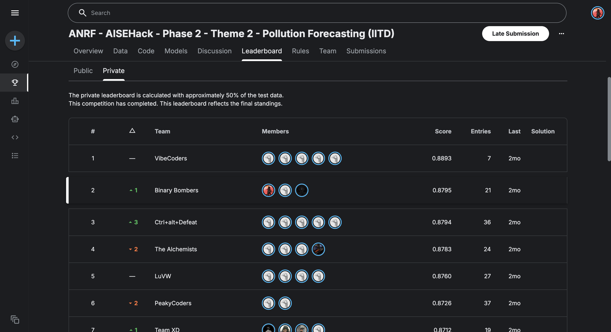

# 🌬️ PM2.5 Pollution Forecasting Demo

**ANRF AISEHack Phase 2 — Theme 2 — Pollution Forecasting (IIT Delhi)**

This demo visualizes predictions from a **ConvLSTM + Fourier Neural Operator (FNO)** hybrid model
trained to forecast PM2.5 air pollution levels across a 140×124 spatial grid over Northern India.

## Live Links

- Live Demo: https://huggingface.co/spaces/sumit1703/pm25-forecasting
- Dataset: https://huggingface.co/datasets/sumit1703/pm25-forecasting-data
- GitHub: https://github.com/sumitjadhav1703/pm25-forecasting-demo

## Important Note

This Space visualizes precomputed PM2.5 predictions saved from the Kaggle GPU run. It does not run live model inference, training, or torch at runtime.

## How to Use

1. Use the **Test Window** slider to select a time period from the test dataset
2. Use the **Forecast Hour** slider to select how far ahead (+1h to +16h)
3. Compare the last known PM2.5 map (left) with the model's forecast (right)
4. Read the statistics below the maps

## Model Architecture

| Component | Details |
|-----------|---------|
| Encoder   | Stacked ConvLSTM (2 layers) |
| Spatial   | Fourier Neural Operator (FNO) |
| Decoder   | UNet with SE blocks |
| Input     | 10 hours × 20 atmospheric features × 140×124 grid |
| Output    | 16-hour PM2.5 forecast |
| Training  | Kaggle T4 GPU, ~8 hours |

## Competition Results

- **Competition:** ANRF AISEHack Phase 2 — Theme 2 (IIT Delhi)  
- **Team:** MGM  
- **Phase 2 Rank:** 2  
- **Final Score:** 0.8795 (sMAPE-based)

## Kaggle Leaderboard Proof

The final private leaderboard for **ANRF - AISEHack - Phase 2 - Theme 2 - Pollution Forecasting (IITD)** shows:

* **Team:** Binary Bombers
* **Final Rank:** 2
* **Final Score:** 0.8795
* **Entries:** 21

> Note: Kaggle competition pages may require login to view the leaderboard.

Competition link: https://www.kaggle.com/competitions/anrf-aise-hack-phase-2-theme-2-pollution-forecasting-iitd

## Dataset

The competition dataset contains 4 months of WRF-simulated atmospheric data:
APRIL_16, JULY_16, OCT_16, DEC_16. Features include PM2.5, wind components,
temperature, PBLH, and various emission tracers.

> Built by Sumit — B.Tech AI & Data Science, JNEC MGM University
